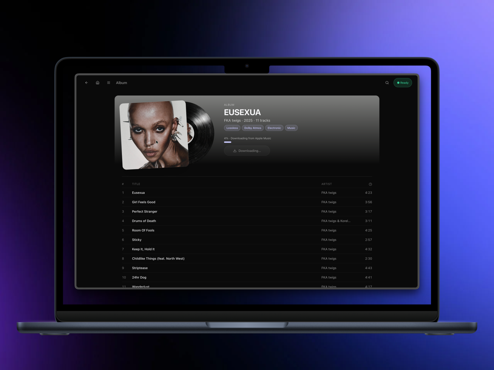
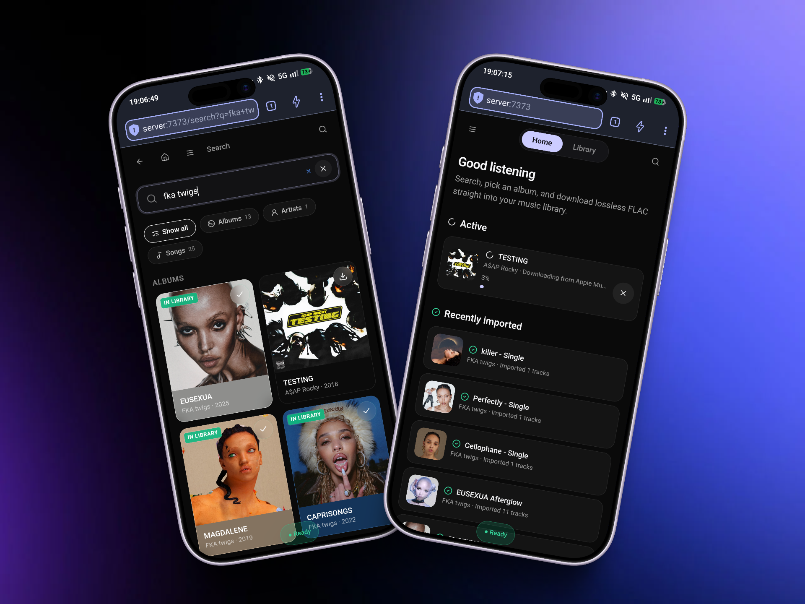
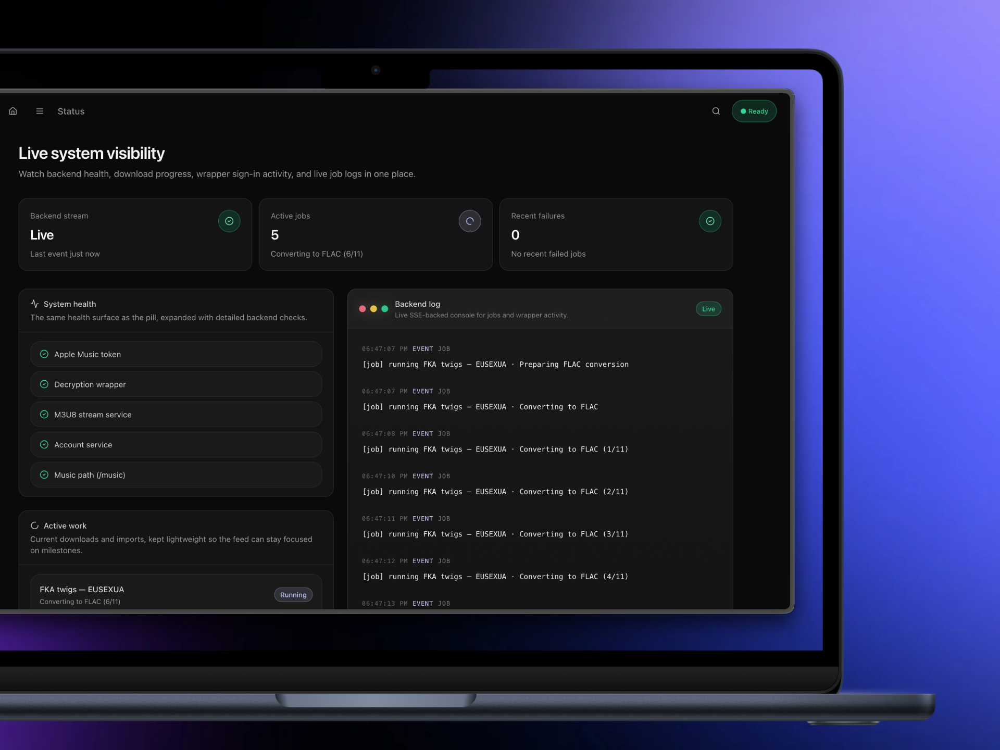

# ALACarte

Self-hosted Apple Music downloader with a polished web UI.

  

## What it is

ALACarte is a browser-based tool that downloads lossless audio from Apple Music, converts it to FLAC, and organizes it into a clean library structure you can point any media server at.

- **Search & Discover:** Full access to the Apple Music catalog (albums, artists, songs, playlists).
- **Lossless & Hi-Res:** Download ALAC streams and auto-convert to FLAC with embedded artwork and metadata.
- **Lyrics Support:** Fetch embedded lyrics and sidecar `.lrc` files (requires `media-user-token`).
- **Smart Queuing:** Queue individual tracks, whole albums, playlists, or bulk-select entire artist discographies (filtered by LPs/EPs/Singles).
- **Library Awareness:** Duplicate prevention visually flags what is already in your library so you don't re-download.
- **Explicit / clean filtering:** Apple lists explicit and clean masters as separate albums. Pick your preference in Settings (or show both) to keep search results tidy.
- **Follow Artists:** Follow an artist to auto-download new releases as they drop. Choose to grab their current discography on follow or only watch for future releases. ALACarte checks on a self-tuning schedule (configurable in Settings) that scales with your roster size to stay well under Apple's daily API limits.

Output lands in `/music/<Artist>/<Album>/01. Track.flac` (or `/music/<Artist>/Singles/` for individual songs). Playlist downloads are merged into the same artist/album library structure and also emit `/music/Playlists/<Playlist>.m3u8` with relative paths so Jellyfin/Navidrome can import playlist order.

---

## Beautiful and functional. Not just on the desktop.

<table style="border: none;">
  <tr>
    <td width="50%" align="center">
      
       
      <b>Fully responsive design</b> 
      Search, queue, and manage your library effortlessly from your phone.
    </td>
    <td width="50%" align="center">
      
       
      <b>Complete system visibility</b> 
      Watch your server work in real-time with an SSE-backed console, live job tracking, and granular health metrics.
    </td>
  </tr>
</table>

---

## Disclaimer
**This tool is for personal archival use only.** Downloading music you do not have a valid subscription/license for violates Apple's Terms of Service. You are responsible for ensuring your use complies with applicable terms and laws in your jurisdiction.

---

## Requirements

- **`linux/amd64` (x86_64)** — the FairPlay wrapper binary and the upstream downloader image are amd64-only. On Apple Silicon Macs, Docker Desktop transparently emulates amd64 via Rosetta. On native arm64 Linux (Raspberry Pi, ARM cloud VPS), enable `qemu-user-static` / `binfmt_misc` to run amd64 containers, or use an x86_64 host.
- Docker + Docker Compose
- An **Apple Music paid subscription**

## Quick start

1. `git clone` this repo and `cd` into it
2. Copy `.env.example` to `.env` and set `MUSIC_PATH` to your music library folder
3. Run `docker compose up -d --build`
4. Open `http://<your-host>:7373`
5. Grab the one-time setup token from logs (`docker compose logs alacarte-web`) and use it on the welcome screen with your new username/password
6. Go to Settings → enter your Apple ID email, password, and preferred storefront

## Upgrade notes

Upgrading an existing deployment:

1. Pull latest changes and rebuild: `docker compose up -d --build`
2. If your current install has no auth configured yet, open the UI and complete first-time setup with the one-time setup token from logs.
3. If you already have auth configured, sign in normally.

No manual data migration is required for `data/web/settings.json` or existing encrypted Apple credentials.

## Security

ALACarte ships with a built-in single-password gate. The first time you visit the UI, you'll be prompted to set a username/password and the one-time setup token from server logs — every API endpoint and page is then locked behind it.

A few things to keep in mind:

- **Don't expose this directly to the public internet.** Several cloud providers ship hosts with permissive default firewalls. Verify your firewall, and put a reverse proxy / VPN / mesh network in front of the UI before opening it up to anything beyond your LAN.
- **`/var/run/docker.sock` is mounted into the web container** so it can spawn the wrapper container during first-time Apple login. That effectively grants the web container root on the host — another reason not to expose it directly.
- **Tighten the bind to localhost only:** set `WEB_BIND=127.0.0.1` in `.env` if you front the app with a reverse proxy on the same machine and don't want the UI reachable on your LAN.
- **Already running your own auth?** Set `AUTH_DISABLED=true` in `.env` to skip the built-in password gate (e.g. when fronting with Authelia, Cloudflare Access, Tailscale, etc).
- **Rate limiting and lockouts are built in** for setup/login/password-change routes (429 + Retry-After + temporary lockouts).
- **Sessions support revoke-all** from Settings → Account ("Sign out on all devices").
- **Password hashing uses memory-hard scrypt** (`N=131072, r=8, p=1`).
- **Trust proxy and secure cookies:** set `TRUST_PROXY` correctly when running behind a reverse proxy so HTTPS detection and cookie security are accurate.
- **Existing users are preserved:** current encrypted Apple credentials in `data/web/settings.json` continue to decrypt after upgrading.
- **Change or reset:** the password lives at `data/web/auth.json`. Change it from Settings → Account, or reset by deleting that file and restarting the container — the next visit will prompt for a new one.

## First login flow

ALACarte needs to authenticate with Apple to obtain decryption tokens. This happens once, then the session persists across container restarts.

1. Enter your credentials in Settings and click Save.
2. If Apple requires 2FA, you'll see a prompt asking for the code sent to your Apple devices.
3. Enter the code within ~2 minutes.
4. When you see "Ready", you're good to search and download.

### Sign-in troubleshooting

If Apple sign-in fails, check these first:

1. Confirm the Apple ID has an active Apple Music subscription on `music.apple.com`.
2. Confirm the Apple ID has signed into Apple Music at least once on a real Apple device or on the web app.
3. Confirm the host IP is not in a VPS/datacenter range Apple commonly blocks.
4. Confirm the storefront in Settings matches the Apple ID's region.
5. Confirm you're running the latest image/build (newer builds include login parser fixes and richer wrapper diagnostics).

## How downloads behave

- Jobs run **one at a time** — queuing many items won't speed things up, it just lines them up.
- Download speed is throttled by Apple and varies by time of day.
- After a download completes, each track is converted from ALAC to FLAC and moved into your library (although you can disable this in the settings).
- The queue survives page refreshes but not container restarts.
- If a job fails (network hiccup, decryption glitch), you can re-queue it manually.

## Notes and limits

**IP rate-limiting and proxies** Apple appears to rate-limit by IP if you query huge amounts of data at once. In my experience, this isn't a permanent ban, I got soft-blocked for about a day after downloading ~1500 songs. If you plan to archive massive collections, consider:
- Spreading large jobs across multiple days
- Running behind a VPN or proxy
- Using a container with separate networking

**Storage** - Lossless albums are ~300–600 MB each.
- By default, temporary staging is written to `/tmp/alacarte-staging` while jobs run.
- You can override this with `AMDL_STAGING_PATH` in `.env`.
- Stale job staging folders older than `AMDL_STAGING_MAX_AGE_HOURS` (default `24`) are pruned on app boot.
- If you intentionally point staging inside your music library, configure your scanner to ignore hidden directories.

**Sharing a network with Jellyfin/Plex/etc.** By default ALACarte creates its own `alacarte-net` Docker network. If you'd rather attach to an existing network (e.g. the one your media server already uses), set `DOCKER_NETWORK=<name>` and `DOCKER_NETWORK_EXTERNAL=true` in `.env`.

**Local compose tweaks** If you need to change things the `.env` variables don't cover (extra volumes, additional environment, etc.), drop a `docker-compose.override.yml` next to the main compose file. Docker Compose auto-merges it and it's gitignored, so you can run `docker compose up` normally without polluting the committed config.

**Navidrome Integration** ALACarte includes built-in support for triggering Subsonic API scans in Navidrome. Once you configure your Navidrome credentials in the Settings panel, ALACarte will instantly instruct your server to quick-scan the library the exact moment a download completes. No more waiting for hourly cron jobs!

## Troubleshooting

| Problem | Likely cause | Fix |
|---------|--------------|-----|
| "Sign in required" health warning | Wrapper isn't authenticated | Go to Settings and complete the login flow |
| "Docker socket not available" | First-time login needs host access | For initial setup, run the container with `-v /var/run/docker.sock:/var/run/docker.sock` or see the login instructions in Settings |
| Downloads stuck at 0% | Apple token expired or wrapper down | Wait a moment; it will auto-retry. If still stuck, restart the stack |
| Tracks show "failed" | Temporary Apple/server hiccup | Re-queue the album; transient failures usually clear |
| FLAC files are truncated | MP4Box runtime issue | Rebuild the container image and redeploy |

## Architecture

ALACarte runs on a shared Docker network with three primary components:
- **web:** This repository. It wraps the downloader CLI as a child process and serves the React SPA on port `7373`.
- **amdp:** The underlying downloader binary, included at build time.
- **wrapper:** A FairPlay decryption daemon that handles the DRM removal, included at build time.

## Credits

Built upon:
- [zhaarey/apple-music-downloader](https://github.com/zhaarey/apple-music-downloader)
- [WorldObservationLog/wrapper](https://github.com/WorldObservationLog/wrapper)

The UI design was heavily inspired by the beautiful [Abyss theme](https://github.com/AumGupta/abyss-jellyfin), which was then customized and expanded from the ground up for this project.

## License

MIT — see LICENSE

---

  <a href="https://www.buymeacoffee.com/sosjalapeno">Buy me a Claude subscription</a>

